# GitHub 技术雷达 - Android 应用

# 快速使用
直接安装 [app-debug.apk](app-debug.apk)

**GitHub 技术雷达** 是一款功能强大的 Android 应用，旨在帮助开发者探索、发现和跟踪 GitHub 上的热门技术趋势。通过本应用，您可以轻松掌握最新的技术动态，发现优秀开源项目，并利用 AI 技术对项目进行智能分析。

## 主要功能

*   **技术趋势跟踪**: 查看每日、每周、每月的 GitHub 热门仓库。
*   **主题浏览器**: 探索不同技术主题下的热门项目，并查看 30 天活跃度趋势。
*   **强大的搜索功能**: 搜索仓库、用户和技术主题。
*   **AI 智能分析**:
    *   **README 摘要**: 利用 AI 技术快速生成任何仓库 README 的核心摘要。
    *   **技术趋势分析**: 对比分析多个仓库和主题，生成技术趋势报告。
    *   **个人技术雷达**: 根据您的 GitHub 活动生成个性化的技术雷达图。
*   **收藏夹**: 收藏您感兴趣的仓库和主题，方便日后查看。

## 如何编译和运行

1.  **克隆仓库**:
    ```bash
    git clone https://github.com/your-username/your-repo-name.git
    cd your-repo-name
    ```

2.  **获取 API 密钥**:
    *   **GitHub Token**:
        *   访问 [https://github.com/settings/personal-access-tokens](https://github.com/settings/personal-access-tokens)
        *   生成一个新的 personal access token，并授予 `repo` 和 `user` 权限。
    *   **OpenRouter API Key**:
        *   访问 [https://openrouter.ai/settings/keys](https://openrouter.ai/settings/keys)
        *   创建一个新的 API key。

3.  **配置 API 密钥**:
    *   在项目根目录下，创建一个名为 `local.properties` 的文件。
    *   复制 `local.properties.example` 的内容到 `local.properties`。
    *   将您的 GitHub token 和 OpenRouter API key 添加到 `local.properties` 文件中，如下所示：
        ```properties
        GITHUB_API_TOKEN="your_github_api_token"
        OPENROUTER_API_KEY="your_openrouter_api_key"
        ```

4.  **构建并运行**:
    *   使用 Android Studio 打开项目。
    *   等待 Gradle 同步完成。
    *   点击 "Run 'app'" 按钮来构建和运行应用。

## 技术栈

*   **Kotlin**: 主要编程语言。
*   **Jetpack Compose**: 用于构建现代化的声明式 UI。
*   **MVVM 架构**: 用于分离业务逻辑和 UI。
*   **Hilt**: 用于依赖注入。
*   **Retrofit**: 用于处理网络请求。
*   **OkHttp**: 用于网络请求的底层实现。
*   **Paging 3**: 用于实现分页加载。
*   **Room**: 用于本地数据缓存。
*   **Coroutines & Flow**: 用于异步编程。

## 架构

本应用采用 **MVVM (Model-View-ViewModel)** 架构，并结合了 **Repository** 和 **Clean Architecture** 的思想，以实现模块化、可测试和可维护的代码。

  <!-- I will create this image later -->

## 演示截图

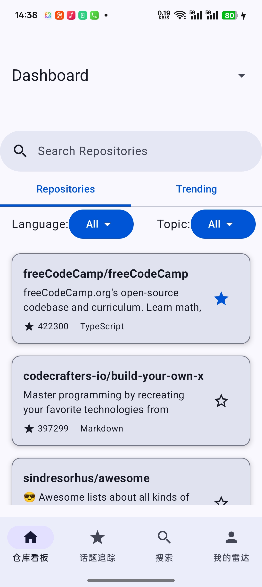
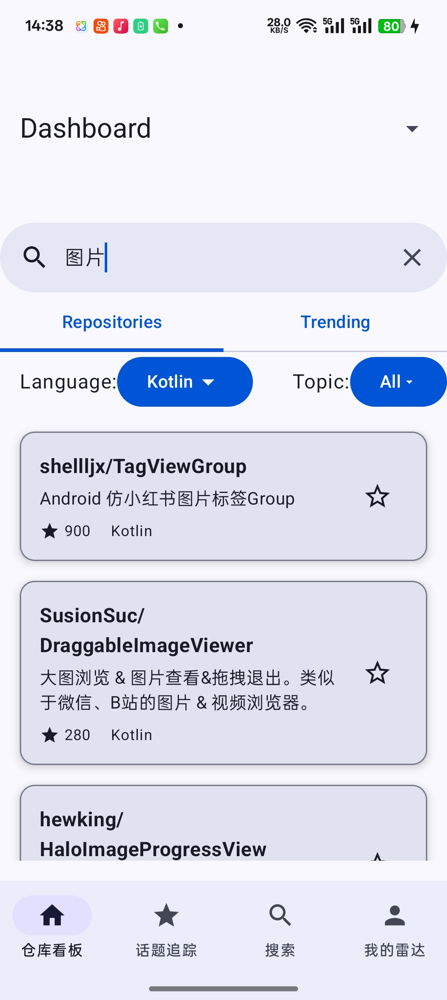
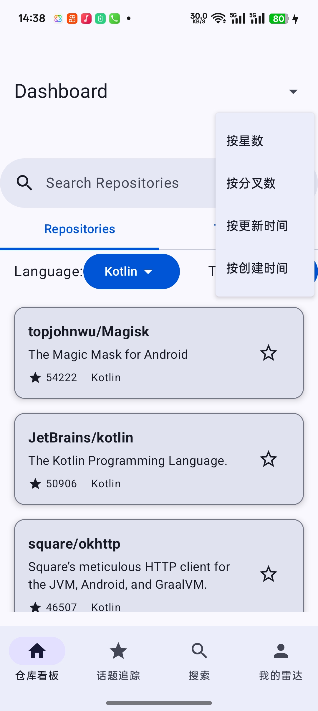
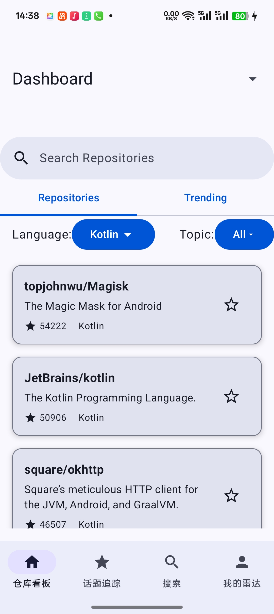
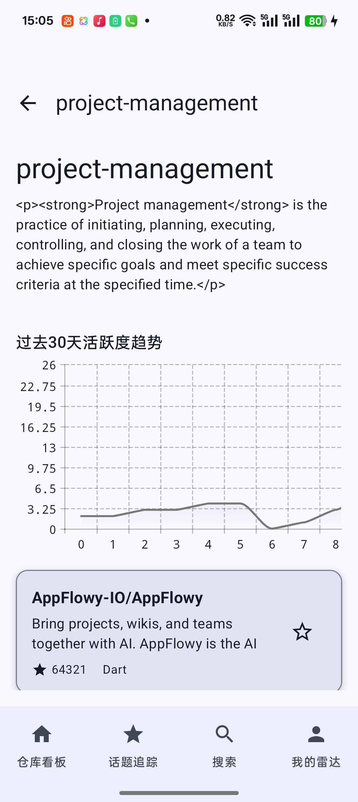
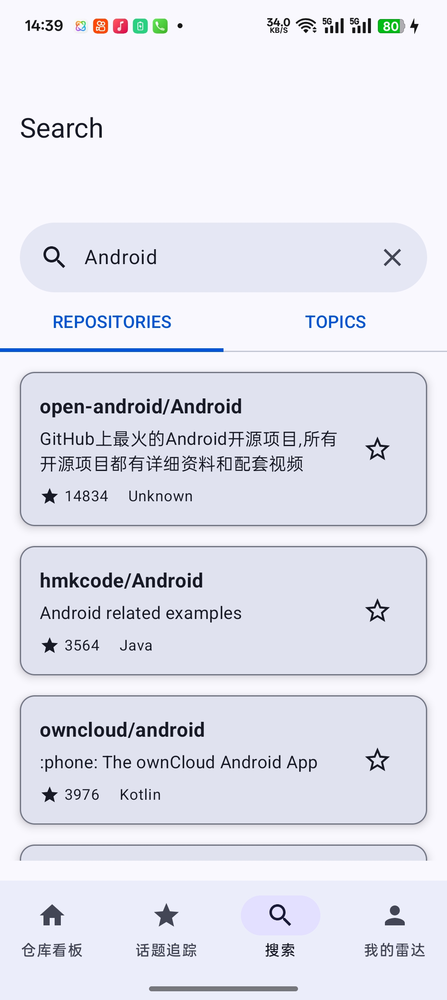
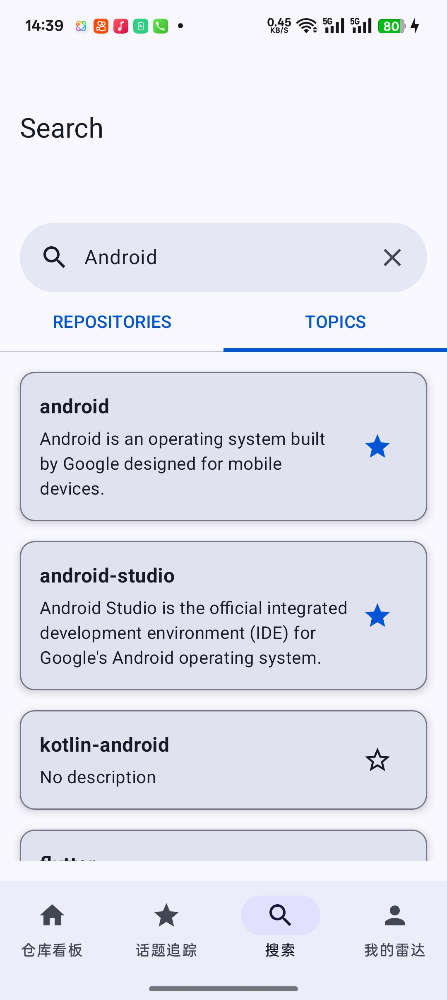
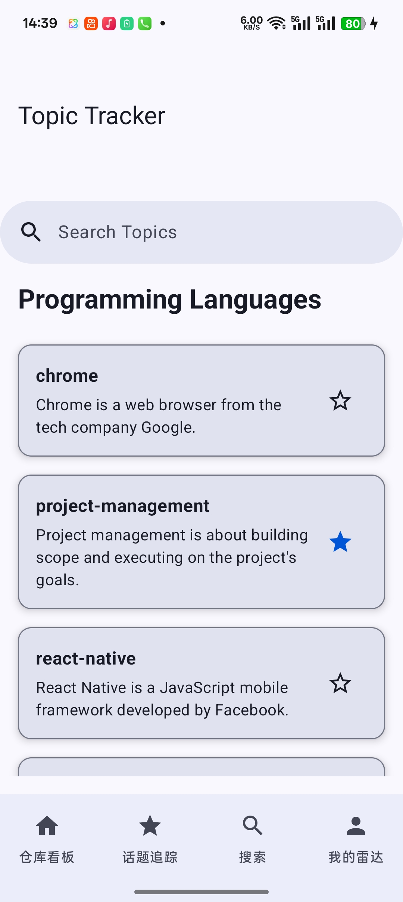
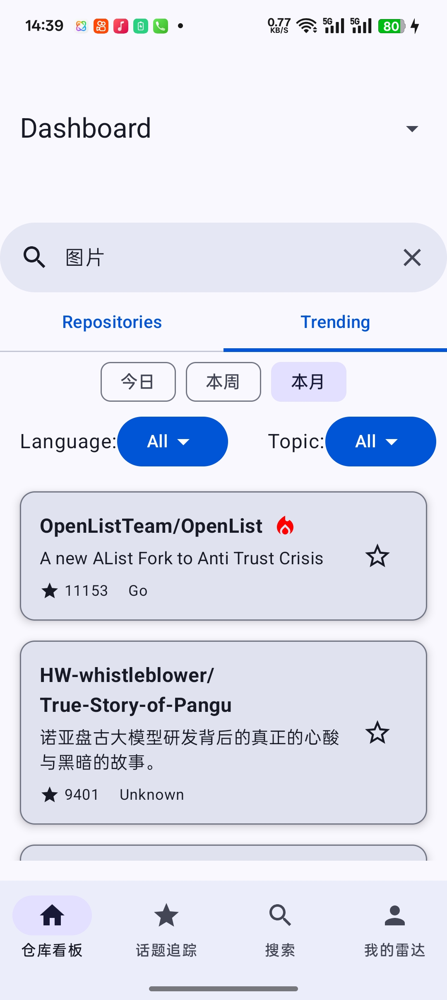
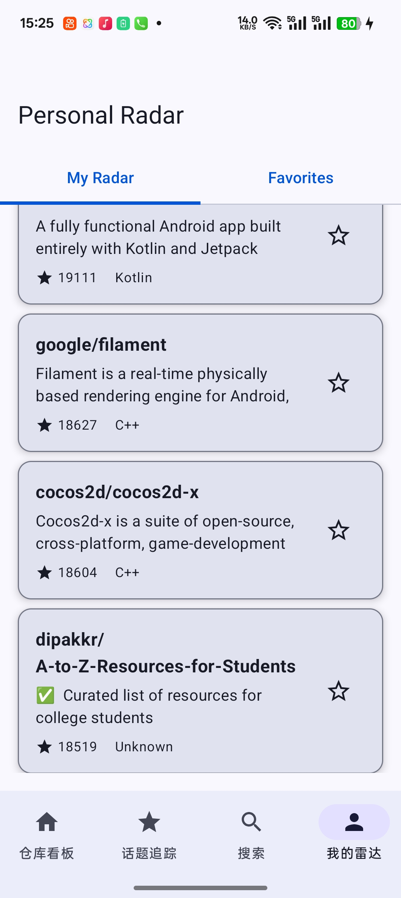
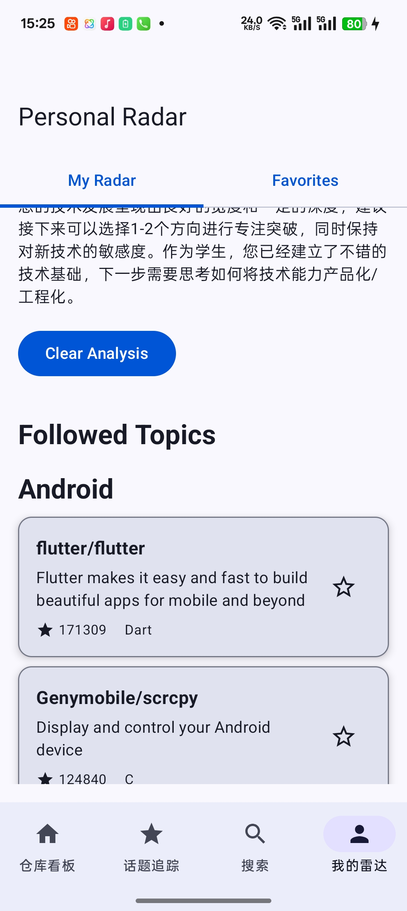

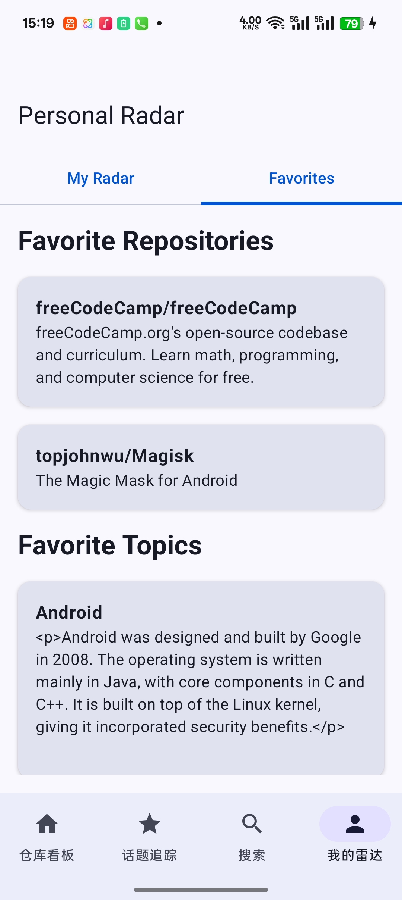


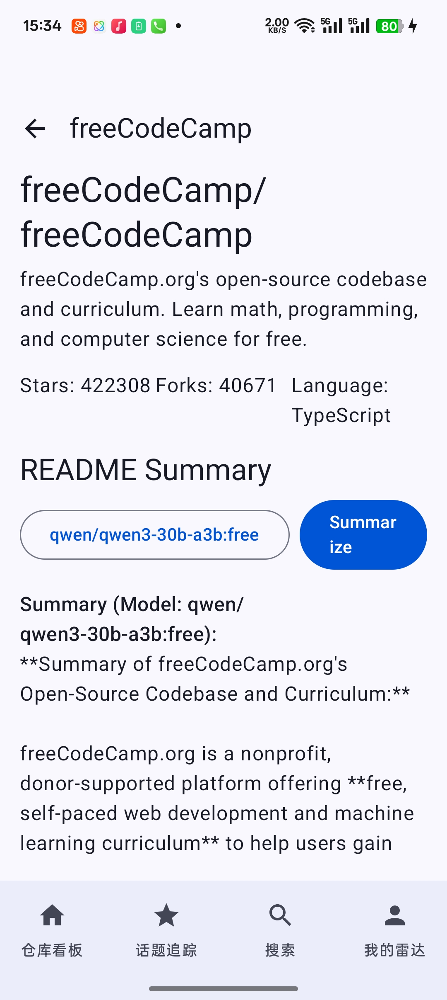

